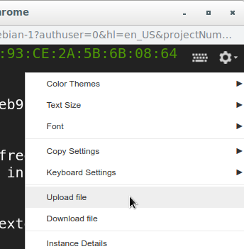
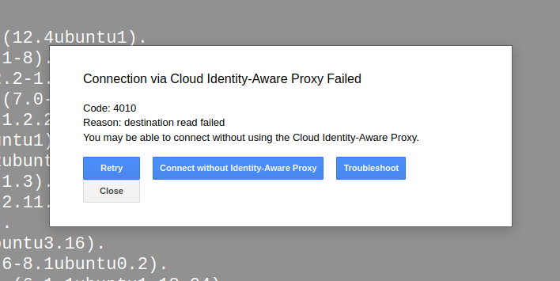

# cdps-practica-creativa-2

## Despliegue de aplicación en máquina virtual pesada

### Requisitos

- Máquina virtual con Ubuntu instalado

### Pasos a seguir

1. Preparar el tarball necesario para suministrar a la máquina:

```bash
    ./prepareTarball.sh
```

2. Iniciar una sesión ssh en la máquina virtual y una vez dentro usar la funcionalidad siguiente para subir el tarball creado en el paso anterior (cdps-pc2.tar.gz):



3. Dentro de la consola de la máquina virtual, ejecutar las siguienter órdenes para descomprimir el tarball y ejecutar el script que instalará el entorno python necesario y reiniciar la máquina:

```bash
    rm -rf bookstore && mkdir bookstore && tar xvf cdps-pc2.tar.gz -C bookstore && rm -rf cdps-pc2.tar.gz && \
        cd bookstore && ./setupVM.sh
```

Cuando la máquina se reinicie, su terminal se quedará sin conectividad y saldrá el siguiente error:



Espere unos instantes y haga click en "Retry" para acceder nuevamente al terminal de la máquina recién arrancada.

4. Finalmente, para levantar el servicio bookstore, ejecutar:

```bash
    cd bookstore && ./runBookStore.sh
```

### TODOs
- Probar a prescindir de pyenv, si funciona sin más quitar todo lo relativo