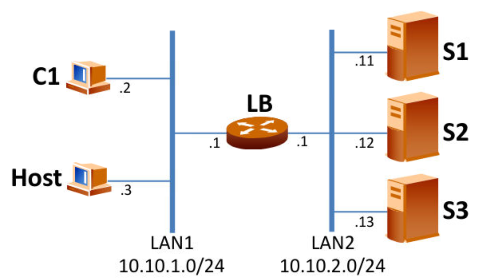

# Automatización de escenario virtual de balanceo de carga
## Marta Arcones y Teresa Charlo

Este script provee de ciertas opciones que permitiran al usuario crear el escenario siguiente:



Así como controlar su ejecución, monitorizarlo o destruirlo.

## Ayuda con el script
Ejemplos de uso:

```bash
./auto-p2.py download
./auto-p2.py prepare --num_serv 5
./auto-p2.py launch
./auto-p2.py monitor
./auto-p2.py monitor --domain s3
./auto-p2.py stop
./auto-p2.py release
```

También puede ejecutar `./auto-p2.py --help` para encontrar indicaciones.
