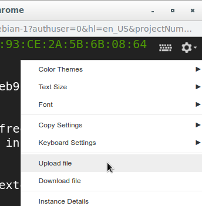

# Despliegue en máquina virtual de Google Cloud Platform

## Requisitos
- Máquina virtual con Ubuntu instalado y el puerto 80 (HTTP) abierto

## Decisiones de diseño tomadas
* La máquina virtual se preparara instalando `pyenv` y con esta funcionalidad se instala una versión específica de `python` y `pip`, para evitar problemas con la distintas versiones de `python` y/o dependencias si se delegase en la versión de `python` que viene por defecto con el sistema operativo
* La aplicación bookstore se levanta en el puerto designado (el indicado en los argumentos de entrada al programa o, en su defecto, el predeterminado), pero este puerto no se expone a Internet. En lugar de esto se usa `socat` para hacer una redirección del tráfico del puerto de la aplicación al 80, y así que las conexiones desde Internet a la máquina se hagan sin la necesidad de explicitar el puerto. El objetivo de esto es aprovechar la configuración que trae Google Cloud Platform por defecto para el puerto 80, que a buen seguro será más fiable que cualquier configuración que podamos hacer el máquina para exponer otro puerto manualmente.

## Comentarios acerca de la fiabilidad y escalabilidad de esta solución
* Se ha intentado asegurar la fiabilidad de la solución planteada preparando la máquina con un entorno de `pyenv` para no depender del entorno python instalado en la máquina por defecto, pues este podría cambiarse en versiones de Ubuntu superiores
* Además el motivo de exponer a Internet la aplicación en el puerto 80 en lugar de en el 9080 y redireccionar con `socat` se hace siguiendo la misma premisa, ya que si cambio el puerto interno en el que sirve mi aplicación en la máquina virtual, como `socat` va a seguir redireccionando al 80 de Internet, no habrá interrupciones de servicio para mis clientes.
* A pesar de lo ya comentado, la fiabilidad de la aplicación se ve enormemente comprometida por el hecho de estar corriéndola en una única máquina, ya que representa un único punto de fallo, y cualquier fallo en el servidor o en la configuración del mismo, afectarla al funcionamiento de la aplicación ineludiblemente, llegando al caso en que si la máquina virtual o el programa servidor que corre dentro tienen una interrupción de servicio, la aplicación dejará de ser servida.
* La solución propuesta podría escalar en vertical añadiendo más recursos de memoria, CPU o almacenamiento a la máquina virtual pero como se ha comentado en el punto anterior, al ser toda la infraestructura única y representar toda ella un único punto de fallo, por mucho que escalemos en vertical no solucionaremos los potenciales problemas más graves.

## Pasos a seguir

1. Preparar el tarball necesario para suministrar a la máquina:

```bash
    cd ./despliegue-en-gcp && ./prepareTarball.sh
```

2. Iniciar una sesión ssh en la máquina virtual y una vez dentro usar la funcionalidad siguiente para subir el tarball creado en el paso anterior (cdps-pc2.tar.gz):



3. Dentro de la consola de la máquina virtual, descomprimir el tarball y ejecutar el script que instalará el entorno python necesario:

```bash
    rm -rf bookstore && mkdir bookstore && \
        tar xvf cdps-pc2.tar.gz -C bookstore && \
        rm -rf cdps-pc2.tar.gz && cd bookstore && \
        ./setupVM.sh
```

4. Reiniciar la shell para aplicar los cambios

```bash
    source ~/.profile
```

5. Establecer el valor de la variable de entorno que completará el título de la web:

```bash
    export GROUP_NUMBER="Equipo 09"
```

6. Finalmente, para levantar el servicio bookstore, ejecutar:

```bash
    ./runBookStore.sh
```

Si se quiere correr la aplicación en un puerto distinto, pasarlo como argumento, por ejemplo:

```bash
    ./runBookStore.sh 9181
```

Aparecerá un mensaje con la URL pública de la aplicación para acceder desde fuera de la máquina.